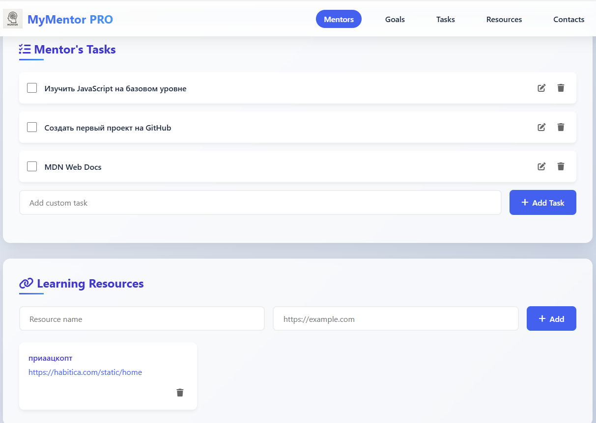
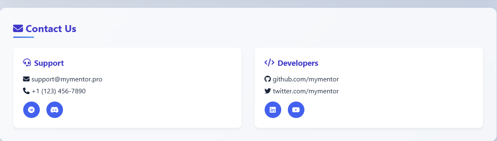

# MyMentor PRO - Персональный трекер развития




MyMentor PRO - это современное веб-приложение для трекинга личного развития с функцией выбора наставника. Пользователи могут:

- Выбрать себе ментора из профессиональных разработчиков
- Установить и отслеживать цели развития
- Работать с задачами, привязанными к курсам
- Сохранять полезные ресурсы
- Все данные сохраняются в браузере (localStorage)

- 🎯 Постановка целей развития
- 👨‍💻 3 профессиональных ментора с разными специализациями
- 📝 Задачи с привязанными обучающими курсами
- 🔗 Коллекция полезных ресурсов
- 📱 Адаптивный дизайн
- ✨ Современный UI с анимациями

## Установка
1. Клонируйте репозиторий:
   ```bash
   git clone https://github.com/yerasyl-hub/mentor2.git
